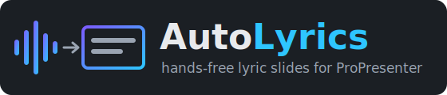

<p align="center">
  
</p>

# AutoLyrics for ProPresenter

**Hands-free lyric slides.** AutoLyrics listens to the room through a microphone, transcribes the singing on-device with Whisper, matches it against the song's slide deck, and fires the right slide in ProPresenter — verified against ProPresenter's own reported state, not fire-and-forget.

No cloud, no timers, no MIDI cues from the band. Just a Mac that hears the song and keeps the lyrics on screen where they belong.

## Why

Every weekend a volunteer sits at a computer pressing the space bar in time with a worship band. When they're late, the congregation stops singing; when they're distracted, the chorus goes up with the verse still on screen. AutoLyrics does that job: it follows the singers, not a click track, so it stays correct through extended bridges, repeated choruses, and spontaneous moments.

## How it works

```
┌─────────────────┐   ┌──────────────────┐   ┌──────────────────┐   ┌──────────────────────┐
│  Audio Capture  │──▶│  Vocal Isolation │──▶│   Lyric Engine   │──▶│  ProPresenter Bridge │
│  (macOS mic)    │   │ (spectral gating)│   │ (faster-whisper) │   │  (HTTP API v1)       │
└─────────────────┘   └──────────────────┘   └──────────────────┘   └──────────────────────┘
```

| Module | Purpose |
|--------|---------|
| `src/audio_capture.py` | Live audio input from the mic (sounddevice), captured at the device's native rate and decimated to 16 kHz |
| `src/vocal_isolation.py` | Real-time-safe spectral gating to reduce music bleed |
| `src/lyric_engine.py` | Windowed faster-whisper transcription + slide-based matching with auto-fire, forward-only bias, jump penalties, and soft-hit confirmation |
| `src/propresenter_bridge.py` | ProPresenter 7 HTTP API: port auto-discovery, slide triggers, and state read-back |
| `src/pro_export.py` | Exports a lyric deck as a native `.pro` presentation that ProPresenter indexes automatically |
| `src/pp_proto/` | Generated protobuf schema for `.pro` files ([greyshirtguy/ProPresenter7-Proto](https://github.com/greyshirtguy/ProPresenter7-Proto), MIT) |
| `src/song_loader.py` | Loads blank-line-separated slide lyrics from the songs directory |

### The matching engine

Whisper transcription of live music through a room mic is noisy — mistranscribed words, dropped phrases, crowd noise. The engine is built to be robust to that:

- **Slide-based matching, not line-based.** Each 12-second transcription window is scored against whole slides. Only the current slide, a small lookahead, and (by default) *no* lookbehind are candidates — back-jumps cause chorus oscillation.
- **Confidence tiers.** A strong match fires immediately; weaker ("soft") matches must repeat across consecutive windows before firing, and jumping 2+ slides ahead requires both extra confidence margin and more consecutive hits.
- **Forward bias with a tie-break toward the earliest candidate**, so repeated sections resolve to the slide the band is actually on.

### Reference decks are built by the pipeline that runs live

A song's slide deck isn't hand-typed — it's produced by playing the actual recording through the speakers, listening through the mic, and transcribing with the *same* windowed pipeline used on Sunday. Then it's pruned for self-consistency: the deck is simulated at multiple time offsets and with injected noise, and slides that don't fire in order across all variants are removed (with a density floor — ≥6 slides, roughly one per 45 seconds — so pruning can't produce a trivially-passing skeleton deck). The result: the deck only contains slides the live pipeline can reliably recognize.

### Hard-won ProPresenter lessons baked in

- **`.pro` export clones a ProPresenter-authored template.** Hand-built protobuf cues parse to *zero* slides in ProPresenter even when structurally identical. The exporter embeds a verified PP-authored cue + presentation skeleton and swaps in UUIDs and lyric RTF.
- **Deck names are content-hashed** (`AutoLyrics - <song> [<sha1-6>]`) because ProPresenter caches a deck's parse by name for its whole session, even across file deletion. Edit the lyrics and the name changes with them.
- **Read-back everywhere.** Every fired slide is confirmed against ProPresenter's reported `slide_index`; a mismatch is logged, never silently ignored.

## Requirements

- macOS with ProPresenter 7 — **Settings → Network → Enable Network** checked (leave the port on auto; AutoLyrics discovers it)
- Python 3.11+
- A microphone that hears the room (the built-in MacBook mic works)

## Quick start

```bash
git clone https://github.com/danielalanbates/auto-lyrics-pro-presenter.git
cd auto-lyrics-pro-presenter
python3 -m venv .venv
.venv/bin/pip install -r requirements.txt

# Sanity checks
.venv/bin/python -m src.main --list-devices
.venv/bin/python -m src.main --list-songs

# Go live: exports the deck into ProPresenter (first run), targets it,
# then auto-fires slides as the song is sung
.venv/bin/python -m src.main --song "For All My Days (Live at Camp)"
```

Songs live in `~/songs` as `.txt` files: one slide per blank-line-separated block. See [INSTRUCTIONS.md](INSTRUCTIONS.md) for the full operator runbook — service-day steps, adding songs, and gotchas.

## Testing

The harness is a genuine acoustic loop: it plays real recordings through the speakers, listens through the mic, runs the full live pipeline, and requires every slide to fire in order (0..N-1). No injected audio, no mocked transcription.

```bash
# Build references + live-test the whole playlist against a mock bridge
.venv/bin/python -m tests.run_playlist

# Verify against REAL ProPresenter over the HTTP API
.venv/bin/python -m tests.pp_verify api                 # deterministic: trigger + read back every slide
.venv/bin/python -m tests.pp_verify live "Track Name"   # full loop: mic → whisper → real PP slides
.venv/bin/python -m tests.pp_verify live-all
```

`tests/live_playlist/results.json` records per-song results; re-runs skip songs that are already perfect. Run tests in a quiet room — the loop is acoustic, and background conversation pollutes transcription.

## License

MIT — see [LICENSE](LICENSE). The `.pro` protobuf schema is from [greyshirtguy/ProPresenter7-Proto](https://github.com/greyshirtguy/ProPresenter7-Proto) (MIT). Test recordings are copyrighted audio and are not distributed with this repository.
